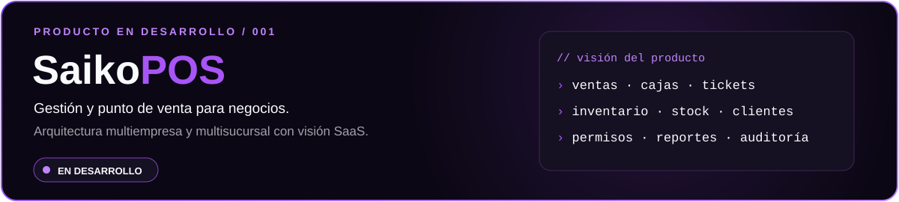

<div align="center">



<br />


</div>

<h2></h2>

```text
$ cat leandro.txt
nombre    : Leandro Tomás Castro
rol       : Full Stack Developer
proyecto  : SaikoTech
creando   : SaikoPOS · aplicaciones web · sistemas de gestión
base      : Argentina
```

Desarrollo soluciones digitales para negocios y personas. Con **SaikoTech** estoy construyendo productos que convierten procesos complejos en herramientas claras y útiles. Hoy mi foco está en **SaikoPOS**, un sistema de gestión y punto de venta pensado para crecer como SaaS.

Me interesan las aplicaciones rápidas, seguras y adaptables a la forma de trabajar de cada negocio.

<h2></h2>

<div align="center">

**Frontend**  


**Backend y datos**  


**Herramientas**  


</div>

<h2></h2>

<div align="center">

</div>

**SaikoPOS** está pensado para que distintos negocios gestionen ventas, productos, inventario, cajas y usuarios desde una misma plataforma, con separación segura de datos por empresa. También contempla roles, auditoría y reportes.

`Next.js` · `React` · `TypeScript` · `Tailwind CSS` · `Supabase` · `PostgreSQL` · `Vercel`

> 🚧 Proyecto en desarrollo.

<h2></h2>

<div align="center">


<br />


</div>

<h2></h2>

<div align="center">

**Construyendo SaikoTech y aprendiendo en público.**  
Si te interesan mis proyectos, seguí mi trabajo en GitHub.

<a href="https://github.com/LeandroTomasCastro"></a>

<br /><br />


</div>
